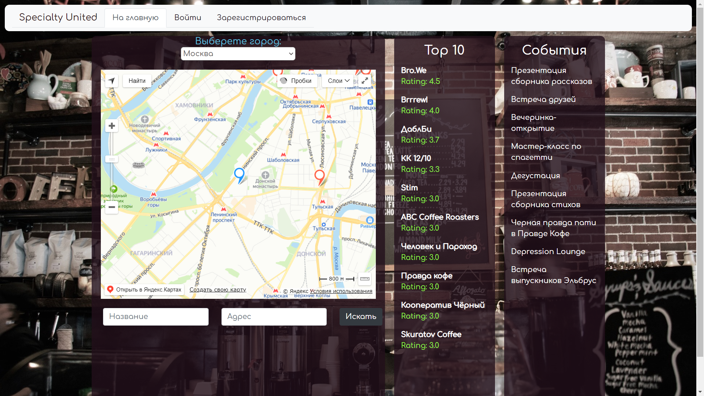

# Агрегатор кофеен категории specialty "Specialty united"

Вы любите кофе и хотите найти хорошую кофейню категории specialty?
Скорее всего, существующие поисковые инструменты вас не удовлетворят.
Предлагаем воспользоваться приложением "Specialty United", в котором собраны только проверенные кофейни.

Вы можете находить конкретную кофейню, информацию о меню, бариста, зерне, событиях в кофейне.
Также вы можете оставить отзыв или же организовать событие.

Если в приложении отсутствует знакомая вам кофейня, вы можете добавить ее в базу и наполнить информацией.

## Начало работы
```
- В папках client и server команда yarn
- В папках client и server команда yarn start
```

## MVP функционал
- Регистрация новых пользователей
- Личный кабинет (возможность изменить учетные данные, а также посмотреть избарнные кофейни)
- Отображение кофеен на карте (Yandex API)
- Добавление новых кофеен
- Рейтинг кофеен (и отображение ТОП-10 кофеен рейтинга на главной странице)
- Отображение актуальных событий на главной странице (и возможность перехода на страницу события)
- Страница кофейни (возможность оставить оценку, посмотреть меню, бариста, зерно, оставить отзыв, организовать событие)

## Авторы
- [Алексей Костюков](https://github.com/fuel-coffee)

- [Антон Бочкарев](https://github.com/anbochkarev1991)

- [Илья Пшеничкин](https://github.com/ILIA-sudo)

## Главная страница
На главной странице представлена карта с кофейнями, которая в случае согласия пользователя на определение местоположения показывает ближайшие к нему заведения. Также отображается ТОП-10 кофеен по рейтингу. 
На страницу конкретной кофейни можно перейти как с метки на карте, так и по ссылке из рейтинга.


